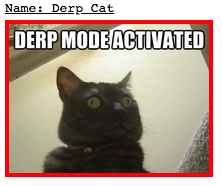

An example project showing how to use the directive test library [angularjs-directive-renderer](https://github.com/omril321/angularjs-directive-renderer)

In this example, we will define a single directive in the app, called `awesome-cat`.  
The directive has two states, defined by the boolean scope variable `derp`.  
`derp` will affect on which image will be presented, and which css class will be applied to the image.  
In tests, we would like to see that our directive is being rendered properly in both states, with the expected styling:  
1. `derp = true`: a derp cat should be displayed with a **red** border.
2. `derp = false`: a cute cat should be displayed with a **blue** border.

Using `angularjs-directive-rendered` lib, we can easily test both states, using the following line:
```javascript 1.7
const scope = {data: {shouldDerp: true}};

cy.renderIsolatedDirective({
    templateToCompile: '<awesome-cat derp="data.shouldDerp"></awesome-cat>',
    injectedScopeProperties: scope
});
```


And for a derp cat:  



#### Usage
* Install the dependencies using:
```bash
npm install
```

* Run the tests using:
```bash
npm run test
```
This will start an http server, which will serve our simple application.  
The tests will access our application, and will render the directive in both modes described above.  

In order to open `Cypress` and see the tests run, use:
```bash
npm run test:open
``` 
